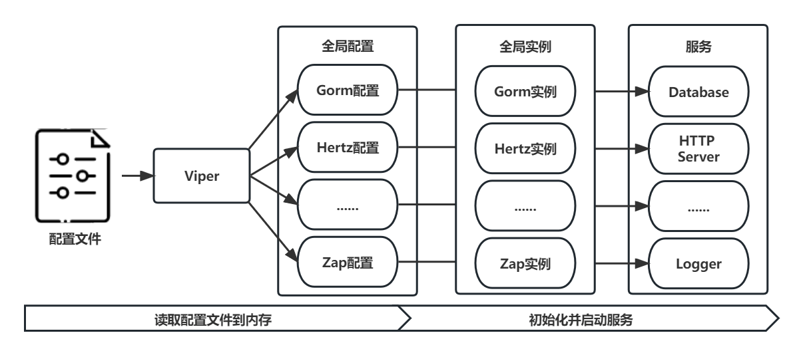

# 极简版抖音后端服务代码仓库

<div align=left>


</div>

该项目属于第五届字节跳动青训营后端进阶班极简版抖音后端服务开发大项目。项目特点如下：
- 服务基于字节跳动开源HTTP框架[Hertz](https://www.cloudwego.io/zh/docs/hertz/overview/)，使用[Hertz生成工具](https://www.cloudwego.io/zh/docs/hertz/tutorials/toolkit/toolkit/)快速构建项目框架；
- 使用Uber开源框架[Zap](https://github.com/uber-go/zap)管理日志，实现按日期按日志级别进行日志管理，实现方法参考了[gin-vue-admin](https://github.com/flipped-aurora/gin-vue-admin)项目；
- 可以根据`config.yaml`配置文件配置全局参数；
- 项目结构清晰，方便扩展。


## 1. 项目结构
- biz: 基于Hertz框架的HTTP服务端代码
- config: 定义配置信息参数的模型，和`config.yaml`文件对应
- global: 定义全局参数，例如数据库实例、配置实例等，方便扩展和读取
- idl: 存储 thrift IDL 文件，用于自动生成HTTP服务的框架
- initialize: 全局服务的初始化，例如数据库连接、HTTP服务启动等
- model: 数据库表模型
- util: 定义一些工具方法，例如Token颁发与解析等
```
├── biz: Hertz服务相关代码
│    ├── cache: Redis数据访问
│    │    ├── comment.go: 评论计数
│    │    ├── favorite.go: 点赞计数及状态获取
│    │    └── relation.go: 关注和粉丝计数及状态获取
│    ├── dal: MySQL数据访问
│    │    ├── comment.go: 评论信息的数据访问
│    │    ├── message.go: 聊天消息的数据访问
│    │    ├── user_login.go: 用户登录信息的数据访问
│    │    ├── usre_info.go: 用户个人信息的数据访问
│    │    └── video_info.go: 视频信息的数据访问
│    ├── handler: 逻辑层
│    │    └── douyin
│    │         ├── base: 基础功能
│    │         │    ├── feed_service.go: 视频信息的推送
│    │         │    ├── publish_service.go: 发布视频以及获取发布的视频列表
│    │         │    └── user_service.go: 用户注册与登录以及用户个人信息的获取
│    │         ├── interact: 视频交互功能
│    │         │    ├── comment_service.go: 评论的发布和获取
│    │         │    └── favorite_service.go: 点赞行为以及获取点赞的视频列表
│    │         └── relation: 社交功能
│    │              ├── message_service.go: 朋友聊天
│    │              └── relation_service.go: 关注行为
│    ├── middleware: 中间件
│    │    ├── access_log.go: 记录访问日志
│    │    └── jwt.go: JWT鉴权
│    ├── model: 请求体和响应体结构（Hertz工具生成）
│    └── router: 路由注册（Hertz工具生成）
├── config: 配置信息结构, 对应yaml配置文件
│    ├── config.go
│    ├── gorm_mysql.go: MySQL配置信息
│    ├── hertz_server.go: Hertz配置信息
│    ├── jwt.go: JWT配置信息
│    ├── redis.go: Redis配置信息
│    ├── upload.go: 视频上传配置信息
│    └── zap.go: 日志配置信息
├── config.yaml: 配置文件
├── Dockerfile: Dockerfile
├── global: 全局变量
│        └── global.go: 全局变量，如Zap实例、Gorm实例等
├── idl: IDL文件，与biz/handler对应（使用Hertz工具生成代码框架）
│    ├── base.thrift
│    ├── interact.thrift
│    └── relation.thrift
├── initialize: 全局初始化
│    ├── gorm_mysql.go: MySQL初始化
│    ├── makedirs.go: 新建文件夹
│    ├── redis.go: Redis初始化
│    ├── viper.go: 配置信息读取
│    └── zap.go: 日志初始化
├── main.go
├── model: 数据实体
│    ├── comment.go
│    ├── message.go
│    ├── user_info.go
│    ├── user_login.go
│    └── video.go
└── util: 工具
     ├── datetime.go: 获取当前时间
     ├── directory.go: 文件夹创建
     ├── ffmpeg.go: 视频封面截取
     ├── filename.go: 为上传的视频生成文件名
     ├── get_play_url.go: 拼接视频播放链接
     ├── jwt.go: JWT生成和解析
     ├── math.go: 数学相关
     └── redis_key.go: 获取Redis的KEY
```

## 2. 数据库设计
### 2.1 MySQL数据库
将用户登录信息、用户个人信息、视频信息以及评论信息存储在MySQL数据库中：
- 用户登录表（user_login）：存储用户的登录信息，包含登录用户名以及加密存储的密码；
- 用户信息表（user_info）：存储用户的个人信息，包含用户名、昵称、~~粉丝数~~、~~关注数~~等信息；
- 视频信息表（video）：存储视频信息，包含标题、发布者信息ID、~~点赞数~~、存储路径等信息；
- 评论信息表（comment）：存储视频的评论信息，包含被评论的视频ID、评论者ID、评论内容等信息；
- 聊天信息表（message）：存储朋友聊天记录，包含发送方ID、接收方ID、聊天内容、聊天时间等；

数据库ER图：


**更新：使用Redis替换通过MySQL存储的计数信息**

### 2.2 Redis数据库
使用Redis数据库存储用户点赞动作和关注动作以及计数相关的信息存储，使用的`key`如下所示：
```go
const (
	favoriteVideoKey = "favorite_list_uid_%d"
	favoriteCountKey = "favorite_cnt_vid_%d"
	commentCountKey  = "comment_cnt_vid_%d"
	followCountKey   = "follow_cnt_uid_%d"
	followerCountKey = "follower_cnt_uid_%d"
	followUserKey    = "follow_user_uid_%d"
	followerUserKey  = "follower_user_uid_%d"
)
```
- 点赞：用户的点赞视频ID通过数据结构`set`存储，视频的点赞计数通过`string`存储
- 关注：用户的关注ID通过数据结构`set`存储，用户的关注计数通过`string`存储
- 粉丝：用户的粉丝ID通过数据结构`set`存储，用户的粉丝计数通过`string`存储

## 3. 安装和运行
### 3.1 准备工作
- 确保安装和配置好[Golang](https://golang.google.cn/)开发环境，本项目基于Golang 1.19.5开发
- 确保安装和配置好MySQL和Redis环境
- 安装并配置ffmepg：Ubuntu用户可使用`sudo apt-get install ffmepg`直接安装，Windows用户可通过[FFmpeg-Builds](https://github.com/BtbN/FFmpeg-Builds/releases)下载并配置环境变量
- 克隆该项目
### 3.2 编译和运行
- 修改`config.yaml`文件的数据库、Hertz服务等配置信息
- 使用`go build`命令编译构建项目
- 运行编译后的文件

### 3.3 后端服务启动示意图


## 4. 存在的问题
- ~~点赞和关注时MySQL和Redis可能存在数据不一致问题~~
- 关注和粉丝的信息使用Redis存储，在更新用户关系是需要更新多个key，可能存在数据不一致问题

