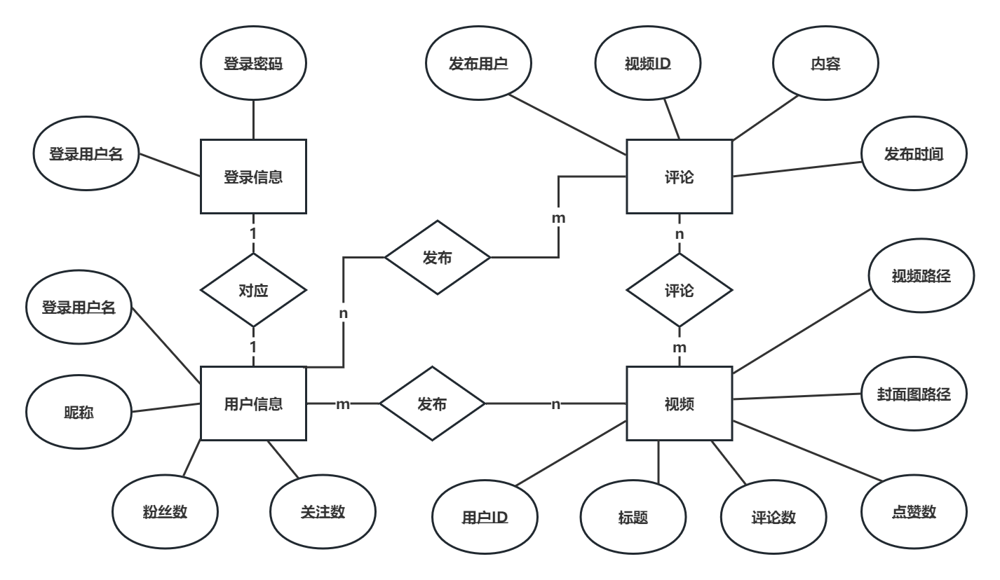

# 极简版抖音后端开发项目
该项目属于第五届字节跳动青训营大项目极简版抖音后端大项目，基于Gorm、Hertz等框架开发。

## 1. 项目结构
- biz: 基于Hertz框架的HTTP服务端代码
- config: 定义配置信息参数的模型，和`config.yaml`文件对应
- global: 定义全局参数，例如数据库实例、配置实例等，方便扩展和读取
- idl: 存储 thrift IDL 文件，用于自动生成HTTP服务的框架
- initialize: 全局服务的初始化，例如数据库连接、HTTP服务启动等
- model: 数据库表模型
- util: 定义一些工具方法，例如Token颁发与解析等
```
├── biz: Hertz后端服务代码
│	├── cache: Redis数据访问层
│	│	└── redis.go
│	├── dal: MySQL数据访问层
│	│	├── comment.go: 评论信息数据访问
│	│	├── user_login.go: 用户登录数据访问
│	│	├── usre_info.go: 用户信息数据访问
│	│	└── video_info.go: 视频信息数据访问
│	├── handler: 逻辑层
│	│	├── douyin
│	│		├── base: 基础功能逻辑层
│	│		│	├── feed_service.go: 视频流信息推送逻辑
│	│		│	├── publish_service.go: 视频发布逻辑
│	│		│	└── user_service.go: 用户注册和登录相关逻辑
│	│		├── interact: 交互功能逻辑层
│	│		│	├── comment_service.go: 评论功能相关逻辑
│	│		│	└── favorite_service.go: 点赞功能相关逻辑
│	│		└── relation: 关系功能逻辑层
│	│			├── message_service.go: 消息相关逻辑
│	│			└── relation_service.go: 关注相关逻辑
│	├── middleware: 中间件
│	│	├── access_log.go: 访问日志中间件
│	│	└── jwt.go: JWT鉴权中间件
│	├── model: 请求响应结构体的模型（Hertz工具自动生成）
│	└── router：路由注册（Hertz工具自动生成）
├── config: 配置的结构体模型
│	├── config.go
│	├── gorm_mysql.go: GORM配置
│	├── hertz_server.go: Hertz配置
│	├── jwt.go: JWT配置
│	├── redis.go: Redis配置
│	├── video.go: 视频上传配置
│	└── zap.go: 日志配置
├── config.yaml: 配置文件
├── global: 全局访问变量
│	└── global.go
├── idl: thrift IDL文件
│	├── base.thrift
│	├── interact.thrift
│	└── relation.thrift
├── initialize: 全局初始化
│	├── gorm_mysql.go
│	├── internal
│	│	├── file_rotatelogs.go
│	│	└── zap.go
│	├── redis.go
│	├── viper.go
│	└── zap.go
├── model: 数据库模型
│	├── comment.go
│	├── user_info.go
│	├── user_login.go
│	└── video.go
└── util: 工具包
	├── datetime.go
	├── directory.go
	├── ffmpeg.go
	├── filename.go
	├── get_play_url.go
	├── human_duration.go
	└── jwt.go
```

## 2. 数据库设计
### 2.1 MySQL数据库
将用户登录信息、用户个人信息、视频信息以及评论信息存储在MySQL数据库中：
- 用户登录表（user_login）：存储用户的登录信息，包含登录用户名以及加密存储的密码；
- 用户信息表（user_info）：存储用户的个人信息，包含用户名、昵称、粉丝数、关注数等信息；
- 视频信息表（video）：存储视频信息，包含标题、发布者信息ID、点赞数、存储路径等信息；
- 评论信息表（comment）：存储视频的评论信息，包含被评论的视频ID、评论者ID、评论内容等信息；

数据库ER图：


### 2.2 Redis数据库
使用Redis数据库存储用户点赞动作和关注动作的相关信息
- 点赞：KEY为`"favor:<userID>"`，数据结构为Set集合
- 关注：KEY为`"follow:<userID>"`，数据结构为Set集合
- 粉丝：KEY为`"follower:<userID>"`，数据结构为Set集合

## 3. 安装和运行
- 确保安装和配置好Golang开发环境，本项目基于Golang 1.19.5开发
- 确保安装和配置好MySQL和Redis环境
- 安装ffmepg

## 4. 存在的问题
- 点赞和关注时MySQL和Redis可能存在数据不一致问题
